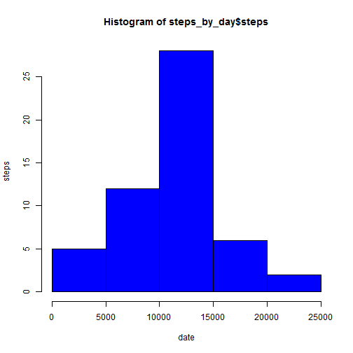
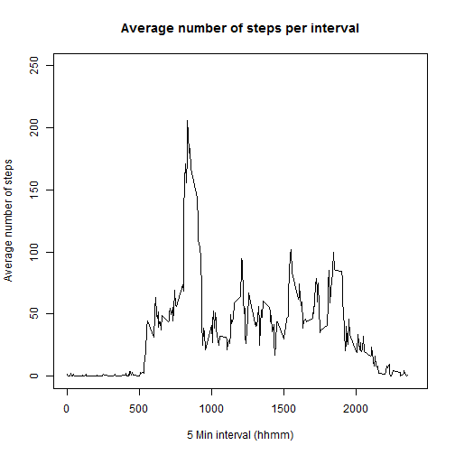
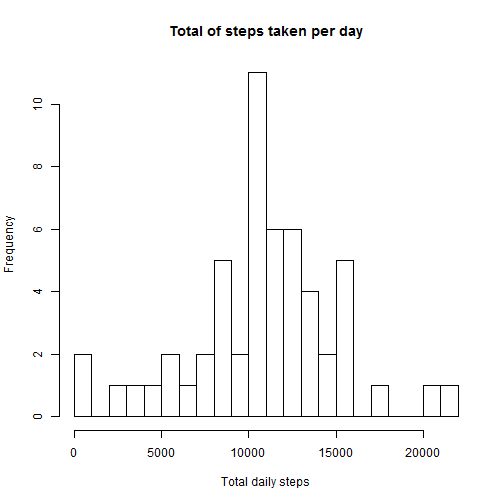
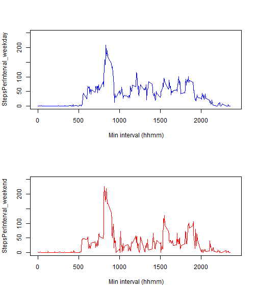

Reproducible Research: Peer Assessment 1
========================================
- Per Erik Skogh Nilsen - htps://github.com/Pesnfy/RepData_PeerAssessment1

#### Unzipping,loading and preprocessing the data


```r
unzip("activity.zip")
data <- read.csv("activity.csv")
```

Total distribution.

```r
steps_by_day <- aggregate(steps ~ date, data, sum)
hist(steps_by_day$steps, xlab = "date", ylab="steps",col="blue")
```

 

Mean and median of raw data.

```r
step_mean <- mean(steps_by_day$steps,na.rm=TRUE)
step_median <- median(steps_by_day$steps,na.rm=TRUE)
```

The mean is 1.0766189 &times; 10<sup>4</sup>and the median is 10765

#### What is the average daily activity pattern?

One way to examine the average daily pattern is to look at how the average value of each interval is distributed:
Make a plot with the daily activity pattern.

```r
StepsPerInterval <- tapply(data$steps, as.factor(data$interval), mean, na.rm = T)
par(mfcol = c(1,1))

plot(levels(as.factor(data$interval)), StepsPerInterval, type = "l", xlab = "5 Min interval (hhmm)", 
    ylab = "Average number of steps", main = "Average number of steps per interval", 
    ylim = range(0:250), xlim = range(0:2400))
```

 


Identify the interval with the largest number of steps.


```r
library(plyr)
activity <- ddply(data, .(interval), summarize, steps = mean(steps, na.rm = T))
with(activity, plot(interval, steps, type = "l"))
```

 

```r
max_interval <- StepsPerInterval[which.max(StepsPerInterval)]
```
alternatively

```r
StepsPerInterval_sorted <- sort(StepsPerInterval,decreasing = TRUE)
head(StepsPerInterval_sorted)
```

```
##      835      840      850      845      830      820 
## 206.1698 195.9245 183.3962 179.5660 177.3019 171.1509
```
The mean is 1.0766189 &times; 10<sup>4</sup> and the median is 10765.
Both methods confirm that the interval between 8:35 and 8:40 AM has the highest average number of steps.

#### Imputing missing values


```r
Totna <- sum(is.na(data$steps))
sum(is.na(data$steps))
```

```
## [1] 2304
```
`Totna` is the total number of missing data points.


Our strategy for filling all the missing datasets is to change intervals with NA to intervals with the average for that interval.


```r
steps <- vector()
for (i in 1:dim(data)[1]) {
    if (is.na(data$steps[i])) {
        steps <- c(steps, StepsPerInterval[i])
    } else {
        steps <- c(steps, data$steps[i])
    }
}

activity_nona <- data.frame(steps = steps, date = data$date, 
    interval = data$interval)

hist(tapply(activity_nona$steps, activity_nona$date, 
    sum), xlab = "Total daily steps", breaks = 20, main = "Total of steps taken per day")
```

 

```r
total_daily_steps <- as.numeric(tapply(activity_nona$steps, 
    activity_nona$date, sum))
```
The new mean is

```r
mean(total_daily_steps, na.rm = T)
```

```
## [1] 10766.19
```
and the new median is

```r
median(total_daily_steps, na.rm = T)
```

```
## [1] 10765.59
```


#### Are there differences in activity patterns between weekdays and weekends?

We start by creating a new factor variable with the two levels "weekday" and "weekend" and using them to plot the steps vs. the intervals grouped by the factor. Date class and the weekdaysfunction is applied. Leveling to remidate linguistic difficulties.

```r
activity_nona$date <- as.character(activity_nona$date)
activity_nona$date <- as.Date(activity_nona$date)
weekdays <- weekdays(activity_nona$date)
activity_nona$weekdays <- as.factor(weekdays)
levels(activity_nona$weekdays) <- c("weekday","weekday","weekday","weekday","weekday","weekend","weekend")
```
Now we set up and plot the patterns.

Setting up.

```r
wkdays <- activity_nona$weekdays =="weekday"
wkends <- activity_nona$weekdays =="weekend"
```
Calculating a factorized mean number of steps per interval

```r
StepsPerInterval_weekday <- tapply(activity_nona$steps[wkdays], as.factor(data$interval[wkdays])
       , mean, na.rm=T)
StepsPerInterval_weekend <- tapply(activity_nona$steps[wkends], as.factor(data$interval[wkends])
       , mean, na.rm=T)
```
Plotting

```r
par(mfcol = c(2,1))

plot(levels(as.factor(activity_nona$interval)), StepsPerInterval_weekday,
        type = "l", col = "blue", 
        xlab= " Min interval (hhmm)", 
        ylim = range (0:250), xlim = range (0:2400))
plot(levels(as.factor(activity_nona$interval)), StepsPerInterval_weekend,
        type = "l", col = "red",
        xlab= " Min interval (hhmm)",
        ylim = range (0:250), xlim = range (0:2400))
```

 

The two factors are distinctly different.
The Weekday activity shows a lot of activity in the morning , and a small peak in the evening.
The Weekend activity shows more uniform and higher activity during the day.
